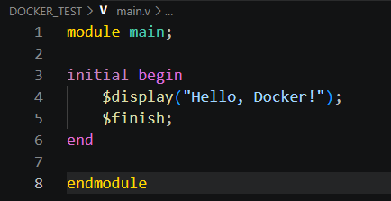
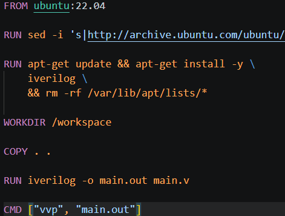
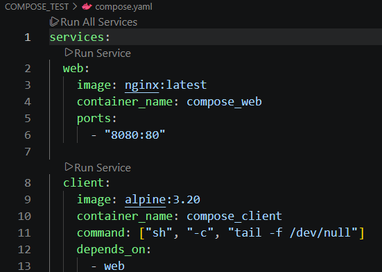

# docker介绍与安装
## 介绍
- Docker：相当于一个纸箱，把软件打包到盒子里，无论在任何电脑里，软件在盒子里的配置都是不变的，可正常运行的，与外部环境隔离开。
如：把每件物品（软件），连同它的保护膜（代码）、专用插头（运行环境）、说明书（依赖库），全部装进一个标准化的魔法纸箱（容器）。到了任何新家，只要把箱子搬进去，拆开就能直接用，完全不管新家是别墅还是公寓（不管服务器是Windows还是Linux）。
- Docker与虚拟机的区别：Docker容器之间共用同一个系统内核，轻便小巧；虚拟机包含一个操作系统的完整内核，笨重。
- Docker镜像：类别于软件安装包。
## 安装
见技术爬爬虾详细教程
## Docker普通命令
- docker pull 命令用来从仓库下载镜像(在命令行里），docker.io/library/nginx:latest → 应用商店/发行厂商/软件：版本号，如果应用商店和发行厂商是docker官方则可不写
- docker images 查看下载过的镜像
- docker rmi IMAGE/IMAGE ID 删除对应ID的镜像
- docker rm -f IMAGE ID 删除正在运行的容器
- docker ps 查看进程状况
- docker stop IMAGE/IMAGE ID 停止运行容器
- docker start IMAGE/IMAGE ID 开始运行容器
- docker create -d IMAGE/IMAGE ID 创建该容器，但不启动
- docker exec IMAGE/IMAGE ID Linux命令 在容器内执行Linux命令
- docker exec -it IMAGE/IMAGE ID bash 进入容器内获得交互式环境，后续命令都是在容器内执行
- docker logs IMAGE/IMAGE ID 查看容器的日志
## Docker重要命令
### Docker run
- docker run IMAGE/IMAGE ID 启动该镜像，可以直接使用该命令，不要先pull，该命令会自动先pull 
-  docker run -d IMAGE/IMAGE ID 分离模式，让镜像在后台运行  
-  docker run -p 宿主机端口:容器内端口，如docker run -p 8080:80 nginx，容器默认有点像一个“隔开的房间”：里面的 nginx 虽然在跑，但你电脑外面不能直接访问容器内部的 80 端口，-p 8080:80 是把容器里的网页服务“接出来”，让你能从自己电脑浏览器访问它。
-  docker run -v 宿主机目录:容器内目录，如docker run -v /website/html:/usr/share/nginx/html nginx,这里把容器内的文件目录和宿主机的文件目录进行了绑定，这种叫做==绑定挂载==，容器内文件目录修改也会导致宿主机文件目录的修改，也叫挂载卷。
### Docker run 其他参数
- docker run -d -p 27017:27017 -e MONGO_INITDB_ROOT_USERNAME=TieHe -e MONGO_INITDB_ROOT_PASSWORD=2514 mongo，对于mongo这样的数据库需要账号密码，直接查文档设置环境变量-e MONGO_INITDB_ROOT_USERNAME=TieHe -e MONGO_INITDB_ROOT_PASSWORD=2514即可
- docker run -d --name my_nginx nginx,其中my_nginx是自定义的容器名
- docker run -it alpine 让控制台进入到容器内部，如--rm经常连一起用
- docker run --rm alpine alpine运行完自动删除
- docker run --restart always alpine 容器停止后会立即重启
- docker run --restart unless-stopped alpine 容器停止后会立即重启，手动停止的不会重启
### Docker volume
- docker volume create nginx_html(卷的名字) 创建数据卷,叫做==命名卷挂载==
- docker volume inspect nginx_html(卷的名字) 查看某个数据卷的详情，可以看到在宿主机的真实目录，不过要切换root用户，sudo -i 切换，就可以查看卷的内容。或者windows系统win+R输入wsl，然后目录返回到docker-desktop的根目录，然后进入\var\lib\docker\volumes就能看见创建的挂载卷。
- docker volume rm nginx_html 删除指定的数据卷
- docker volume ls 查看所有数据卷
- docker volume prune 清除没有任何容器在使用的数据卷
## 实战运行一个网页容器，并映射端口
1. docker run -d --name web_test -p 8080:80 nginx 使用nginx镜像， 把电脑的 8080 端口映射到容器的 80 端口
2. http://localhost:8080 浏览器搜索，则成功映射
## 实战nginx端口显示hello from my volume！
1. docker volume create nginx_html 先创建一个数据卷
2. docker run -d -p 80:80 -v ==nginx_html==:/usr/share/nginx/html nginx 运行nginx容器，并挂载数据卷
3. docker volume inspect nginx_html 查看挂载卷的宿主机真实目录
4. docker ps 查看容器名compassionate——leakey
5. docker exec -it compassionate——leakey ls -l /usr/share/nginx/html 让控制台进入到容器内，查看数据卷
6. docker exec -it compassionate——leakey bash 进入容器准备修改
7. echo '<h1>Hello from my volume!</h1>' > /usr/share/nginx/html/index.html 出现Hello from my volume!在80端口
## 实战构建镜像push到dockerhub上
1. 设置文件夹DOCKER_TEST，内置文件Dockerfile(D大写，无后缀)和main.v
2. main.v这里设置的是Verilog的一段程序

3. Dockerfile是自动化构建蓝图，配置环境标准化

4. 打开终端，运行cd DOCKER_TEST,输入pwd查看路径
5. 终端输入docker build --no-cache -t docker_test_verilog . 构建镜像
6. docker run --rm docker_test_verilog运行该镜像，出现Hello，Docker！
7. docker login登陆dockerhub账户
8. docker tag docker_test_verilog tiehe/docker_test_verilog:latest 给本地的镜像 docker_test_verilog 起了一个带仓库地址的新别名
9. docker push tiehe/docker_test_verilog:latest 将镜像推送到dockerhub上
## 实战了解Docker网络问题
- 让容器和互联网/宿主机/其他容器进行通信，因为容器是一个打包好的环境，通过配置可以实现容器访问外网，主机访问容器，容器间互相访问
- docker network ls 查看网络
- docker network rm -f 自定义网络名 删除自定义网络
- docker inspect web_test 查看容器网络信息，重点关注Networks和IPAddress
- bridge：默认网络，普通容器默认都在这里 host：直接使用主机网络，Windows/Mac 下不常用 none：没有网络
1. docker network create my_net 创建一个自定义网络my_net
2. docker run -d --name web_in_net --network my_net nginx 启动一个 Nginx 容器，加入my_net网络
3. docker run --rm --network my_net curlimages/curl http://web_in_net 启动curl容器，也加入my_net网络，并通过容器名进入Nginx中，这里展示了同一个网络中的容器交互。
## 实战用volume挂载保存容器里的文件
1. docker volume create test_volume 创建volume
2. docker run --rm -it -v test_volume:/data ubuntu:22.04 bash 启动一个Ubuntu容器，把test_volume挂到ubuntu容器上，并在容器内打开终端，/data是自定义的
3. 依次输入echo "hello volume" > /data/hello.txt cat /data/hello.txt exit，依次是把hello volume写进/data里，并创建hello.txt，在用cat读取该文件，最后退出
4. docker run --rm -it -v test_volume:/data ubuntu:22.04 bash 再启动一个新容器，也挂载test_volume
5. cat /data/hello.txt 读取该文件，显示"hello volume"，说明容器虽然换了，且旧的删了，但是挂载卷依旧保留
## bind mount绑定挂载
- bind mount把电脑的真实文件夹挂进容器
- docker run --rm -it -v "D:\2026 2nd CHD\Docker\DOCKER_TEST:/workspace" ubuntu:22.04 bash 把DOCKER_TEST挂载到容器里
- ls /workspace 可以看到电脑上的文件，Dockerfile和main.v
## docker compose
- docker compose实际上相当于是一个脚本，可以直接让docker启动容器、设置端口，共用网络等等
- docker compose up -d 运行yaml文件
- docker compose ps 查看运行情况
- docker compose down 停止并删除创建的compose
- docker compose stop 停止容器
- docker compose start 启动容器
1. 创建COMPOSE_TEST文件夹，并创建文件compose.yaml
2. 在compose.yaml写脚本信息

web：运行 nginx，映射端口 8080:80
client：运行 alpine，用来测试访问 web 容器
1. 打开终端，docker compose version 用来查询版本号
2. cd COMPOSE_TEST 进入文件夹
3. docker compose up -d 运行yaml文件
4. docker compose ps 查看服务
5. 打开浏览器http://localhost:8080，显示Nginx 欢迎页面
6. 执行docker compose exec client wget -qO- http://web ，出现HTMl页面，说明容器间可以互相访问
## docker参数交叉命令组合
- 创建新容器：用 docker run 参数
- 进入已有容器：用 docker exec 参数
- 查看容器：用 docker ps 参数
- 启动旧容器：用 docker start 参数
- 看日志：用 docker logs 参数
---
- -i	--interactive	保持标准输入打开，方便你输入命令
- -t	--tty	分配一个终端界面，让 bash 看起来像正常终端
- -it	-i -t	常一起用，表示交互式进入容器
- -d	--detach	后台运行容器
- -dit	-d -i -t	后台运行，同时保留交互终端能力
- --name	--name 容器名	给容器起名字，方便后续操作
- -p	--publish	端口映射，例如 -p 8080:80
- -v	--volume	挂载目录或数据卷
- --rm	--rm	容器退出后自动删除
- -e	--env	设置环境变量
- --restart	--restart 策略	设置容器自动重启策略
- --network	--network 网络名	指定容器使用的网络
docker的参数很多，可以现查现用